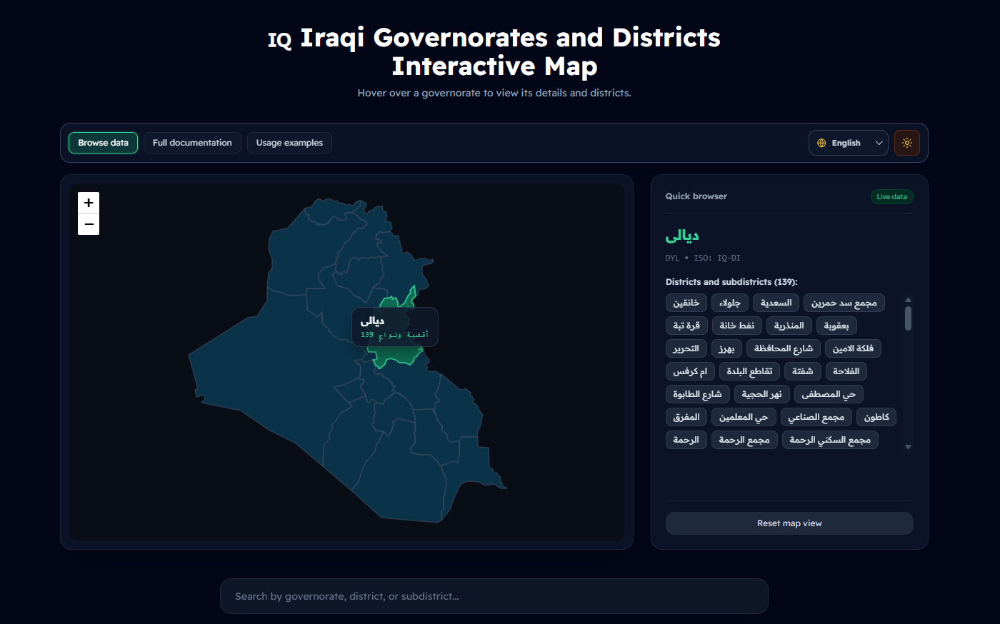

# Iraqi Cities and Districts Data

[English](README.md) | [العربية](README_ar.md) | [کوردی](README_ku.md)

Open JSON reference data for Iraqi governorates and their districts
(subdistricts). The dataset is designed for address forms, delivery
integrations, geographic lookups, and other applications that need stable
city and district identifiers.



[Live preview](https://tawfek.github.io/Iraqi-Cities-and-Districts-data/)

## What is included

```text
data/
  cities.json       # Registry of 18 Iraqi cities
  1-NJF.json        # Districts for Najaf
  2-KRB.json        # Districts for Karbala
  ...
   18-MOS.json       # Districts for Mosul
  geoBoundaries-IRQ-ADM1_simplified.geojson  # Governorate boundaries
examples/
  data/najaf-sample.json  # Small fixture
  javascript/read.js      # Node.js example
  python/read.py          # Python example
scripts/
  validate.js             # Dependency-free data validator
shared.css           # Shared map UI, theme, and component styles
shared.js            # Shared map, data loading, search, and theme logic
```

The single `index.html` page is an interactive browser for the data. It
includes a Leaflet map, city search, collapsible city cards, dark/light mode,
and Arabic, English, and Sorani Kurdish language switching. Additional
languages can be added to the language registry in `shared.js` without
creating another HTML page.

Each city file is a JSON array. `cities.json` is the registry that explains
which governorate a file belongs to. The numeric prefix and three-letter
suffix in a filename match the governorate's `id` and `key`.

The source data currently contains 18 governorates and 3,933 district records.
Names are preserved in Arabic as supplied by the dataset.

## Geographic boundaries

`data/geoBoundaries-IRQ-ADM1_simplified.geojson` is a GeoJSON
`FeatureCollection` containing simplified ADM1 governorate polygons. Its
features use properties such as `shapeName`, `shapeISO`, `shapeID`,
`shapeGroup`, and `shapeType`. The interactive page matches `shapeISO` values
such as `IQ-NA` and `IQ-KA` to `cities.json.iso_code`.

The GeoJSON file provides boundary geometry only. City and district JSON
records do not contain latitude/longitude coordinates.

## GitHub Pages

The repository includes `.github/workflows/pages.yml`, which deploys the
static site automatically when changes are pushed to `main`. In the GitHub
repository, open **Settings > Pages** and choose **GitHub Actions** as the
deployment source. The published URL will be:

```text
https://<owner>.github.io/<repository>/
```

No build command or server is required. Runtime assets use relative paths, so
the map, JSON data, GeoJSON, shared CSS, shared JavaScript, and documentation
links work from a GitHub Pages project subpath.

## Quick start

### JavaScript / Node.js

No third-party packages are required:

```bash
node examples/javascript/read.js
```

Use the data in an application:

```js
const cities = require('./data/cities.json');
const najafDistricts = require('./data/1-NJF.json');

const najaf = cities.find((city) => city.key === 'NJF');
console.log(najaf.name, najafDistricts.length);
```

### Python

The example uses only Python's standard library:

```bash
python examples/python/read.py
```

```python
import json
from pathlib import Path

root = Path("data")
cities = json.loads((root / "cities.json").read_text(encoding="utf-8"))
najaf = next(city for city in cities if city["key"] == "NJF")
districts = json.loads((root / "1-NJF.json").read_text(encoding="utf-8"))
print(najaf["name"], len(districts))
```

## Data model

See [DATA_DICTIONARY.md](DATA_DICTIONARY.md) for field definitions, GeoJSON
properties, file relationships, and identifier guidance. Translated references
are available in [DATA_DICTIONARY_ar.md](DATA_DICTIONARY_ar.md) and
[DATA_DICTIONARY_ku.md](DATA_DICTIONARY_ku.md).

Example records are available in [examples/data](examples/data), including a
small Najaf fixture suitable for tests and documentation.

## Validate the dataset

The repository includes a dependency-free validator for JSON syntax, required
fields, city/file relationships, and duplicate IDs:

```bash
npm run validate
```

You can also run it directly with Node.js:

```bash
node scripts/validate.js
```

## Important notes

- `name` values are Arabic display names and should not be used as unique keys.
- `id`, `key`, and the provider IDs are retained as supplied; applications
  should avoid changing them when syncing records.
- `ebhar_id` may be `null` for a district. Treat that as an absent optional
  mapping, not as an empty string.
- `is_prime_supported` is a boolean indicating whether the district is marked
  as supported by Prime. `prime_id` is retained even when that flag is false.
- The repository does not currently claim an official source, completeness
  guarantee, or update schedule. Contributions that add provenance should
  document it explicitly.

## Contributing

Please read [CONTRIBUTING.md](CONTRIBUTING.md) before changing data or code.
Arabic and Kurdish versions are available as
[CONTRIBUTING_ar.md](CONTRIBUTING_ar.md) and
[CONTRIBUTING_ku.md](CONTRIBUTING_ku.md).
Changes should preserve valid UTF-8 JSON, the existing field names, and the
city-to-file relationship. Run `npm run validate` before opening a pull
request.

## License

The dataset is released under the [Creative Commons Attribution 4.0
International license](LICENSE). The helper scripts and documentation are
released under the MIT license in [LICENSE-CODE](LICENSE-CODE).

When redistributing the dataset, retain attribution to this repository and link
to the applicable license.
